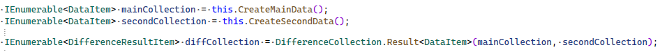
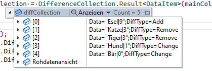
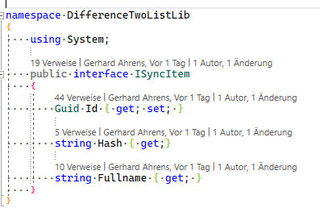

# Difference two Collections 

With this function it is possible to determine the difference between Collection. The result is returned as another collection of type <DifferenceResultItem>.

#### Example

#### Result

## Functionality
The class DifferenceCollection is passed two collections with one type as parameters which inherit from the interface "ISyncItem".
Within the DifferenceCollection class, two comparators are used to check which of the items in the passed collection is new, removed, or changed. For this purpose a collection of the type <DifferenceResultItem> is returned.

### Class Interface

